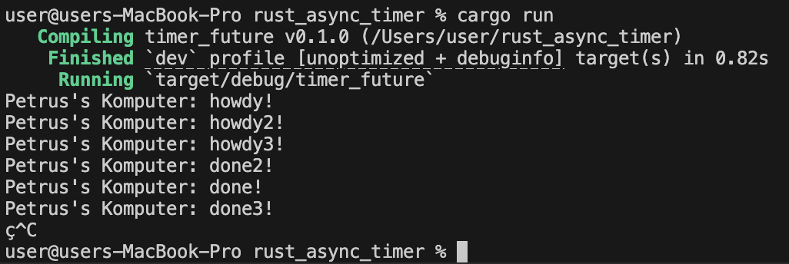

1. 
Teks hey hey akan tercetak sebelum howdy! (atau setidanya sebelum program selesai), hal ini terjadi karena spawner.spawn(...) cuma berfungsi mendaftarkan/memasukkan tugas (task) asinkron ke dalam antrean (queue), tapi tugas itu sendiri belum dijalankan. Baris hey hey adalah kode sinkron (biasa) yang langsung dijalankan saat itu juga oleh fungsi utama. Tugas asinkron (howdy! dan done!) baru benar-benar mulai dieksekusi ketika baris paling bawah, yaitu executor.run();, dipanggil

2. 
Executor (melalui fungsi executor.run()) dirancang untuk terus mendengarkan dan mengeksekusi tugas dari sebuah antrean saluran (channel queue). Dia akan terus berjalan selama sender (yaitu Spawner) masih eksis dan terhubung. Fungsi drop(spawner) berguna untuk menutup/mematikan sender tersebut, yang memberikan sinyal kepada Executor bahwa "Tidak ada tugas baru lagi yang akan datang". Tanpa drop(spawner), Executor akan mengira akan ada tugas baru lagi di masa depan, sehingga ia menunggu selamanya