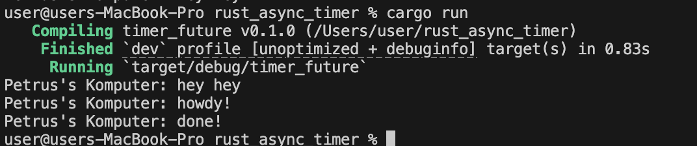

1. 
Teks hey hey akan tercetak sebelum howdy! (atau setidanya sebelum program selesai), hal ini terjadi karena spawner.spawn(...) cuma berfungsi mendaftarkan/memasukkan tugas (task) asinkron ke dalam antrean (queue), tapi tugas itu sendiri belum dijalankan. Baris hey hey adalah kode sinkron (biasa) yang langsung dijalankan saat itu juga oleh fungsi utama. Tugas asinkron (howdy! dan done!) baru benar-benar mulai dieksekusi ketika baris paling bawah, yaitu executor.run();, dipanggil